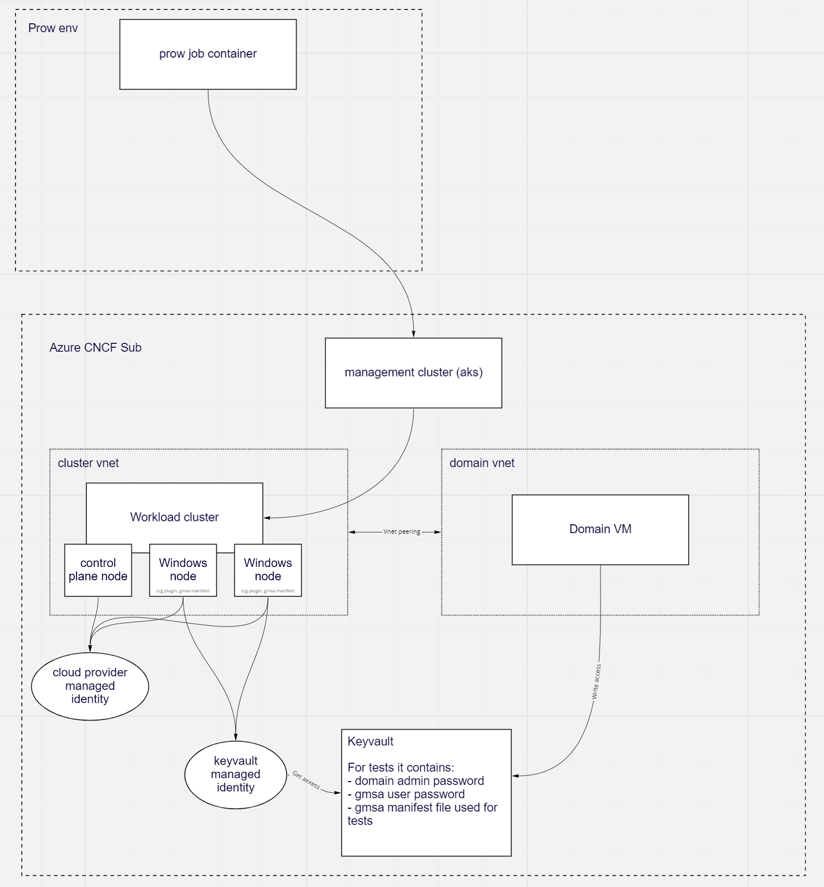

# gMSA and capz

This folder contains the scripts required to configure gMSA with CAPZ using the [Azure keyvault ccg plugin](https://github.com/microsoft/Azure-Key-Vault-Plugin-gMSA).  The plugin is already installed in the CAPZ refrence images via [image builder](https://github.com/kubernetes-sigs/image-builder/blob/master/images/capi/ansible/windows/roles/gmsa/tasks/gmsa_keyvault.yml).

A general overview of the required to run the gMSA:



## Subscrition Setup

The Azure subscription requires a few pre-requisits to be able run the tests.  This is becuase the Managed Identities used with the gMSA plugin need Subscription Owner Permissions to create.

To accomidate this there is a script `setup-gmsa.sh` that does this configuration.  

## Domain VM Creation

The domain VM is created from scratch each test. This is done by `ci-gmsa.sh` and uses cloudbase-init to bootstrap the domain. During bootstrap of the domain it creates domain users and generates the gMSA credspec.  It stores these as secrets in the keyvault used by the tests.

## gMSA template
To generate the gMSA template run:

```bash
kustomize build --load-restrictor LoadRestrictionsNone . > ../templates/gmsa.yaml
```

## Test Configuration

After the cluster is created the e2e suite does some additional setup on the cluster.  It ensures the appropriate secrets are set in the Key Vault then makes sure the required files are on the cluster Worker Nodes for the test. These requirements are documented in the [gMSA e2e test](https://github.com/kubernetes/kubernetes/blob/885f14d162471dfc9a3f8d4c46430805cf6be828/test/e2e/windows/gmsa_full.go#L17-L37)

More details on requirements and implementation are in the [gMSA issue](https://github.com/kubernetes-sigs/cluster-api-provider-azure/issues/1860).  At the end of a test run the secrets and Domain Controller VM are removed unless `SKIP_CLEANUP` is set.

The code to configure the cluster is in `configuration` and can be run against any management cluster passing the arguement `--name "${CLUSTER_NAME}"` as the workload cluster to configure.  It requires a the gMSA domain vm to be created and secrets to be loaded into the keyvault.

```bash
go run --tags e2e configure.go --name "${CLUSTER_NAME}" --namespace default
```

## Running the tests

To run the tests, from the capz folder in this repo:

```bash
GMSA=true ./run-capz-e2e.sh
```